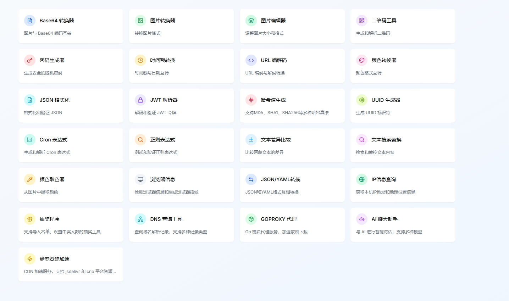

# 在线工具箱

**集成多种实用开发工具，保护您的隐私安全**

**[🚀 立即体验 | Try it now](https://tool.lixf.ink/)**

> 本项目由 AI 生成，基于 Next.js + React + TypeScript 构建，集成多种实用开发者工具

---

## 项目简介 (Project Introduction)

这是一个功能丰富的在线工具箱，专为开发者和日常用户设计。所有工具都在本地浏览器中运行，无需上传数据到服务器，确保您的隐私和数据安全。项目采用现代化的技术栈，提供流畅的用户体验和响应式设计。

---

## 首页预览

---

## 快速部署

### 部署到Tencent EdgeOne Pages

#### 部署到国际站点

#### 部署到中国站点

> 推荐使用 Tencent EdgeOne Pages 部署，可用区选择 不包含中国内地区域的全球区域，IP信息查询、镜像加速、AI聊天等功能依赖EdgeOne的边缘函数功能，使用其它方式部署不支持功能。Tencent EdgeOne Pages 目前是免费使用的。

### 部署到Vercel

### Docker部署

\`\`\`
docker run -d -p 8080:8080 mrlee326/toolbox_web:latest
\`\`\`

中国用户

Chinese User

\`\`\`
docker run -d -p 8080:8080 docker.cnb.cool/xiaofei/toolbox_web:latest
\`\`\`

---

## 特性亮点

### 🔒 隐私保护
- **本地处理**: 所有数据处理都在浏览器本地进行
- **无服务器上传**: 不会将您的数据上传到任何服务器
- **安全可靠**: 开源代码，透明可审计

### 🎨 用户体验 
- **响应式设计**: 完美适配桌面端和移动端 
- **暗色模式**: 支持明暗主题切换 
- **直观界面**: 简洁美观的用户界面
- **快速响应**: 优化的性能，快速的响应速度 

### 🛠️ 开发友好
- **TypeScript**: 完整的类型安全
- **模块化**: 清晰的代码结构和组件化设计
- **可扩展**: 易于添加新的工具和功能
- **现代化**: 使用最新的前端技术栈 

---

## 贡献指南

本项目完全由[v0.dev](https://v0.dev)生成, 暂不接受任何贡献

---

## 许可证

本项目采用 MIT 许可证 - 查看 [LICENSE](LICENSE) 文件了解详情。

---

## 致谢

- 感谢所有开源库的贡献者
- 感谢 [Vercel](https://vercel.com) 提供的优秀部署平台
- 感谢 [v0.dev](https://v0.dev) AI 助手的代码生成支持

---

## 联系方式

如果您有任何问题或建议，请通过以下方式联系我们：

- 提交 Issue
- 发起 Discussion
- 发送邮件 | Send Email: [your-email@example.com]

---

> 本项目由 [v0.dev](https://v0.dev/) AI 生成，致力于为用户提供安全、便捷的在线工具体验。
>
